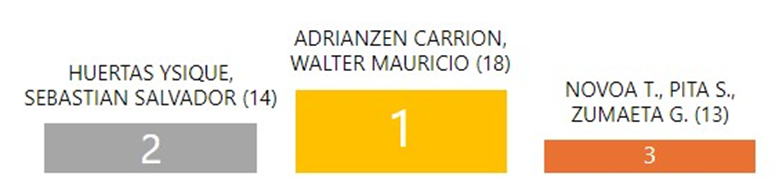

<h1 align="center">Student Statistics 📊</h1>

  

> [!NOTE]
>
> La [implementación de este proyecto](#-implementación-actual) se basa más en
> el [reto modificado](#-reto-modificado). Pero se hace la invitación a revisar
> e implementar el [reto original](#-reto) a manera de ejercicio.

## 🧩 Reto

Desarrollar una aplicación web con Java para el procesamiento de datos de
evaluaciones, con el objetivo de ofrecer al docente información detallada del
rendimiento estudiantil.

### 🛠 Tecnologías

- Java (JDK 21 como mínimo).
- Jakarta EE.
- Tecnologías web Java: JSP/JSF, Facelets tags, Rest, Resource bundles.
- Apache Tomcat, GlassFish u otro servidor Web.
- IDE: cualquiera.

### ✅ Especificaciones funcionales

- Luego de cada evaluación, la plataforma UTP+class proporciona un reporte de
  las notas registradas.
- La plataforma no brinda un detalle de las calificaciones por cada pregunta.
- El docente requiere la información detallada por cada pregunta para conocer
  con más detalle el nivel de aprovechamiento de cada estudiante en los temas
  evaluados.
- Se requiere una aplicación que permita al docente ingresar los puntos
  obtenidos por cada alumno en cada una de las preguntas de un examen. Este
  ingreso se puede realizar por importación de archivo o ingreso manual.
- La aplicación generará un reporte detallado con la información proporcionada.
  El reporte debe incluir:
  - Un gráfico de pastel que muestre el número de aprobados y desaprobados.

    

      
    

  - Un gráfico de barras con el número de estudiantes por cada nota (de 0 a 20).

    

      
    

  - Un podio con los tres primeros puestos (considerar empates).

    

      
    

  - Un gráfico estadístico de barras con el número de alumnos por puntaje para
    cada pregunta de la evaluación.

    

      
    

### ⚙️ Especificaciones técnicas

- La interfaz debe estar construida usando JSP/JSF y Facelets Tags.
- La aplicación debe tener soporte para idioma inglés/español.
- La aplicación consume los datos a través de un servicio REST.
- Toda la información debe ser almacenada en una base de datos.

## 🔀 Reto modificado

El reto modificado es una versión llevada a un enfoque más libre en cuanto el
uso de tecnologías. Además, el soporte para el idioma inglés se vuelve opcional.

## 🚀 Implementación actual

### 🛠 Tecnologías

- Typescript
- Bun JS
- Astro
- Preact
- Tailwind CSS

### 🔧 Especificaciones técnicas adicionales

Además de las
[especificaciones técnicas ya planteadas](#️-especificaciones-técnicas), se han
añadido las siguientes:

- Uso de PWA (Progressive Web App) para una mejor experiencia de usuario en
  dispositivos móviles.
- La aplicación debe tener un soporte básico para un modo offline.

### 🗂️ Recursos

- [Diagrama de base de datos](https://lucid.app/lucidchart/f1db4f3c-965b-4726-9342-d404bdf0dc2d/edit?viewport_loc=-3671%2C288%2C2957%2C1520%2C0_0&invitationId=inv_2e4cd94c-e41e-42c5-b5a0-20014fd7e764)

---

## 📚 Contribución

Si deseas contribuir o proponer mejoras, revisa el
[CONTRIBUTING.md](CONTRIBUTING.md). ¡Tu participación es bienvenida!
